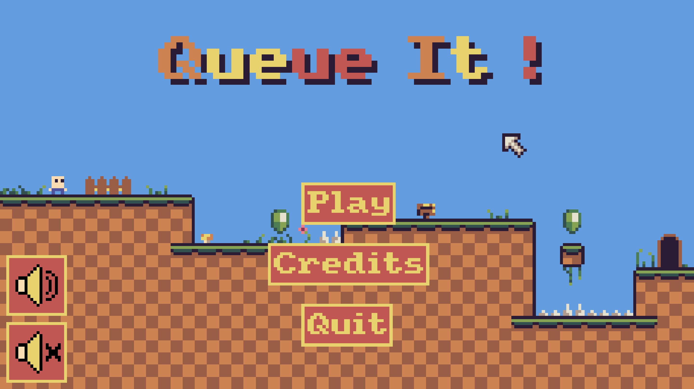

# Queue It !

A fast-paced puzzle-platformer about using the right gem at the right time.

## 📸 Preview

## 🎮 Gameplay

**Queue It!** is a Pyxel platformer where each collectible gem grants you a unique power but there' is a twist :  
You can only use them in the order they appear in your queue. This means you'll need to plan ahead and think creatively to overcome obstacles.

Originally created for **La Nuit du Code 2025**, the game was later expanded into a complete 16 level experience with polished visuals, animations, and sounds.

You can play Queue It ! on [itch.io](https://leo-imbert.itch.io/queue-it).

## 💎 Gem Types & Abilities

| Color  | Name         | Ability |
|--------|--------------|---------|
| 🟢 Green  | **Jump Gem**     | Jump. |
| 🟡 Yellow | **Build Gem**    | Create a platform beneath you. |
| 🩷 Pink   | **Phase Gem**    | Move upward through terrain (up to 4 tiles). |
| 🔵 Blue   | **Dash Gem**     | Dash forward, briefly invincible. |
| 🔴 Red    | **Gravity Gem**  | Reverse gravity. |
| ⚪ Grey   | **Break Gem**    | Destroy nearby breakable tiles. |

## 🕹️ Controls

| Action | Keys |
|--------|------|
| Move left/right | **Arrow Keys / QD / AD** |
| Use first gem in queue | **Space** |
| Interact (doors, dialogs) | **E** |
| Restart level | **R** |
| Back to level selection | **Esc** |

## 🛠️ Built with

- [Pyxel](https://github.com/kitao/pyxel) - Retro game engine in Python.
- Python 3.10+

## 📄 License

This project is licensed under the MIT License. See [LICENSE](/LICENSE) for more information.